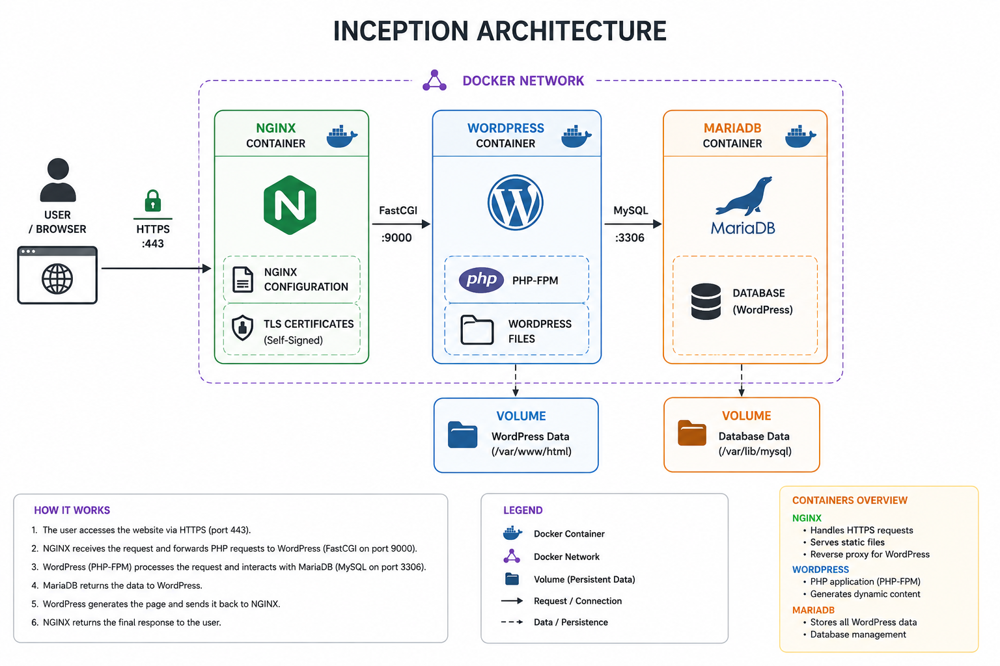
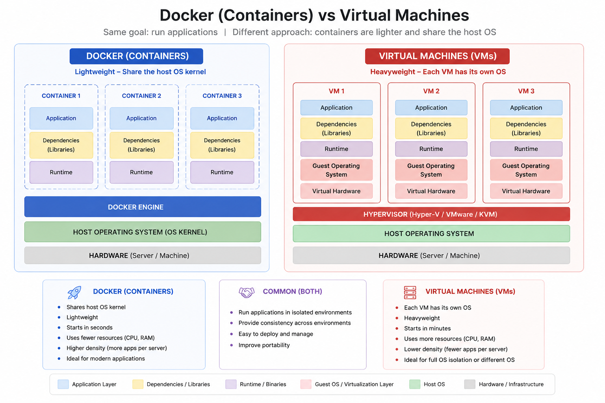

*This project has been created as part of the 42 curriculum by <your_login>.*

# Inception

## Description

Inception is a system administration project focused on building a small, production-like web infrastructure using Docker.

The objective is to containerize multiple services, configure them to communicate securely, and deploy a complete WordPress website. Instead of installing all software directly on the host machine, each service runs inside its own isolated Docker container.

Through this project, we learn the fundamentals of containerization, service orchestration, networking, data persistence, and infrastructure automation—concepts widely used in modern DevOps and cloud environments.

---

## Project Architecture



The infrastructure is composed of three main containers:

### NGINX

- Entry point of the application
- Handles HTTPS connections (TLS)
- Forwards requests to the WordPress container

### WordPress + PHP-FPM

- Hosts the WordPress application
- Executes PHP code through PHP-FPM
- Communicates with the database

### MariaDB

- Stores all WordPress data
- Persists users, posts, settings, and website information

The containers communicate through a private Docker network while their data is preserved using Docker volumes.

---

## Project Flow

```text
        Browser
           │
      HTTPS :443
           │
           ▼
       NGINX
           │
      FastCGI
           │
           ▼
 WordPress + PHP-FPM
           │
     MySQL Protocol
           │
           ▼
       MariaDB
```

1. The browser sends an HTTPS request.
2. NGINX receives and secures the connection.
3. NGINX forwards PHP requests to WordPress.
4. WordPress executes the requested page.
5. WordPress retrieves or stores data in MariaDB.
6. The generated page is returned to the browser.

---

# Docker Overview

Docker is a platform that packages applications and their dependencies into isolated environments called **containers**.

The main components used in this project are:

- **Dockerfile** – Defines how a Docker image is built.
- **Docker Image** – Blueprint used to create containers.
- **Docker Container** – Running instance of an image.
- **Docker Compose** – Starts and manages multiple containers together.
- **Docker Network** – Allows containers to communicate securely.
- **Docker Volume** – Persists data independently from containers.

---

# Design Choices

This project follows a modular architecture where each service has a single responsibility.

- **NGINX** handles web traffic.
- **WordPress** manages the application.
- **MariaDB** stores data.

Keeping services separated improves maintainability, security, scalability, and mirrors real-world production environments.

---

# Comparisons

## Virtual Machines vs Docker



| Virtual Machine | Docker |
|-----------------|--------|
| Includes a full operating system | Shares the host kernel |
| Heavier | Lightweight |
| Slower startup | Starts in seconds |
| Uses more resources | Uses fewer resources |

---

## Secrets vs Environment Variables

**Environment Variables**

- Easy to configure
- Suitable for development
- Stored in `.env` files

**Docker Secrets**

- Encrypted and more secure
- Intended for sensitive production credentials
- Better for production deployments

This project uses **environment variables**, as required by the subject.

---

## Docker Network vs Host Network

**Docker Network**

- Containers communicate privately
- Better isolation
- Recommended for multi-container applications

**Host Network**

- Shares the host network directly
- Less isolation
- Mainly used for specific performance requirements

This project uses a **private Docker network**.

---

## Docker Volumes vs Bind Mounts

**Docker Volume**

- Docker manages where the data is stored.

**Bind Mount**

- You choose the storage folder on your computer.
- Storage location is a folder on the host machine.

This project uses **bind mounts**, as required by the subject, to persist the WordPress and MariaDB data on the host machine.

---

# Instructions

## Requirements

- Docker
- Docker Compose
- Make

## Build and Start

```bash
make
```

or

```bash
docker compose up --build
```

## Stop

```bash
make down
```

## Remove Containers and Volumes

```bash
make fclean
```

## Access

```
https://nel-khad.42.fr
```

---

# Resources

### Official Documentation

- Docker Documentation  

  https://docs.docker.com/

- Introdaction to Docker  

  https://github.com/ahmedsami76/AraBigData/

- GUIDE  

  https://dev.to/alejiri/docker-nginx-wordpress-mariadb-tutorial-inception42-1eok

- MariaDB Documentation  

  https://mariadb.com/kb/en/

- WordPress Developer Documentation  

  https://developer.wordpress.org/


---

# AI Usage

Artificial intelligence was used as a learning and documentation assistant.

It helped with:

- researching Docker concepts;
- guide on project architecture;
- proofreading documentation;
- organizing the README structure.


---